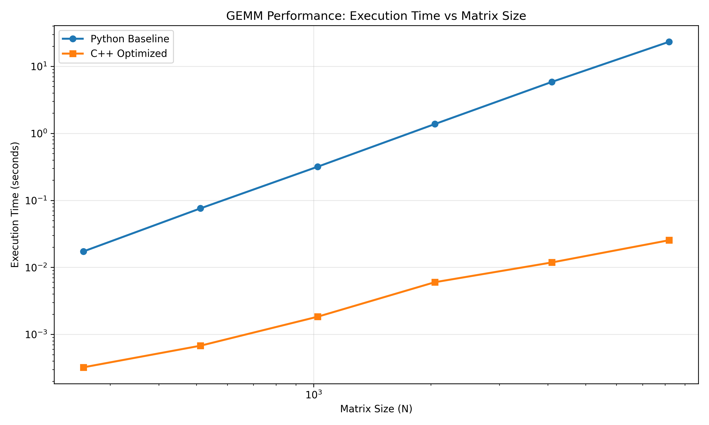
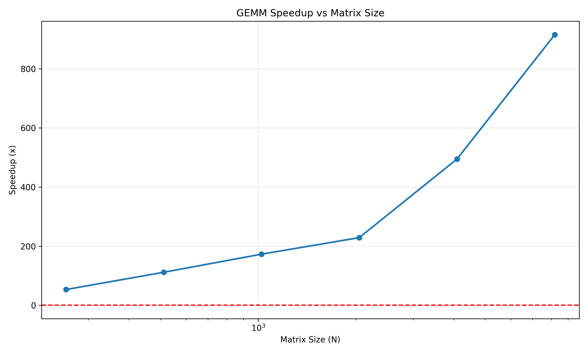
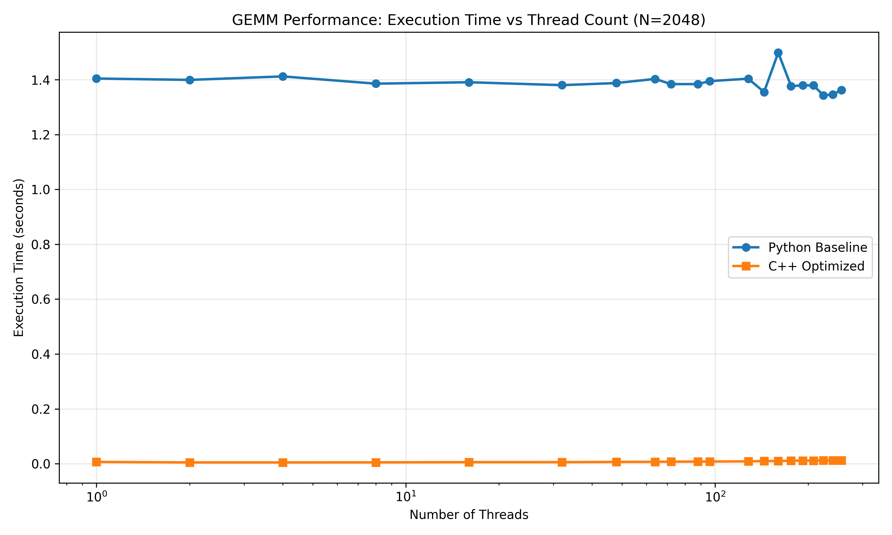
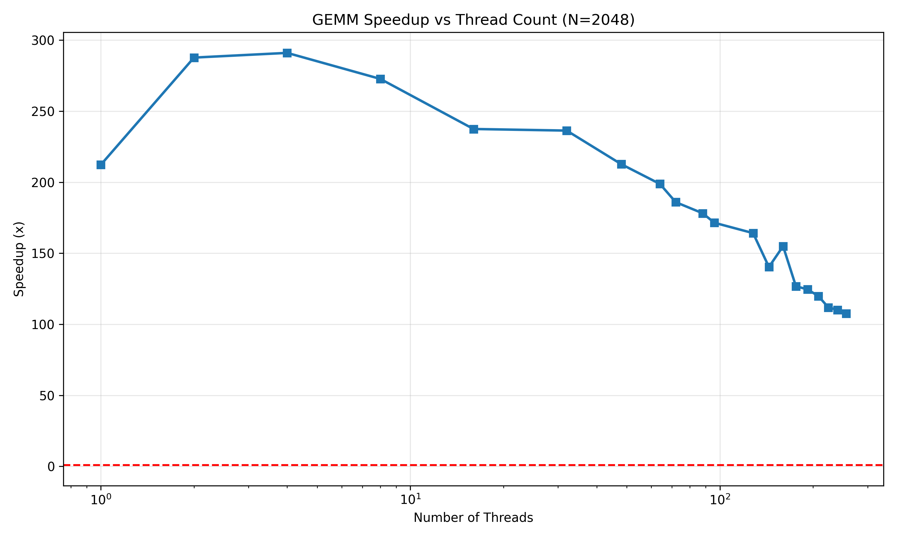

# Acceleration of the General Matrix Multiplication (GeMM)

[GitHub Repository](https://github.com/sai-kaushik-s/Enhanced-GEMM/)

## Team: Sai Kaushik S (2025CSZ8470) & Yosef Ro (2025ANZ8223)

## 1. Problem description

- Application: GEMM (dense matrix multiply)
- Input sizes tested: N = 256, 512, 1024, 2048, 4096, 8192
- Thread sizes tested: P = 1, 2, 4, 8, 16, 32, 48, 64, 72, 88, 96, 128, 144, 160, 176, 192, 208, 224, 240, 256

## 2. Baseline

This repository contains `gemm_baseline.py`, a simple Python script for calculating General Matrix Multiplication (GEMM), $C = A \times B$, in parallel.

It serves as a performance baseline, demonstrating a straightforward parallelization approach using standard Python libraries.

### Core Technologies

- **NumPy**: Used for creating the $N \times N$ matrices (`A`, `B`) and performing the core `dot` product operations. Matrices are 64-bit floats.
- **`multiprocessing`**: Python's standard library for process-based parallelism. A `Pool` of worker processes is created to divide the labor.

### Usage

The script is run from the command line, taking the matrix dimension (`N`) and the number of processes (`P`) as arguments.

```bash
python3 baseline/gemm_baseline.py 1024 4
```

## 3. Optimizations implemented

This repository contains `matrix.tpp`, a header-only C++ template library for performing high-performance General Matrix Multiplication (GEMM).

It is designed for modern x86-64 CPUs and leverages multithreading, cache-blocking, and SIMD vectorization to achieve high GFLOPS.

### Core Features

- **Templated Design**: The `Matrix` class is templated on data type (`T`) and storage layout (`StorageLayout::RowMajor`, `StorageLayout::ColMajor`).
- **Multithreading**: Uses OpenMP for high-level parallelization across CPU cores.
- **Cache Optimization**: Implements a sophisticated cache-blocking (tiling) strategy to maximize L2 cache reuse.
- **SIMD Vectorization**: Features a highly optimized micro-kernel using AVX2 or AVX-512 intrinsics for maximum instruction-level parallelism.

#### 1. Multithreading (OpenMP)

Parallelism is achieved using OpenMP to divide work among multiple CPU cores.

- **Task Partitioning**: The primary parallel region is in the `multiply` function. The two outer loops (iterating over `MC` and `NC` blocks) are collapsed and distributed statically among the OpenMP thread pool.
- **Helper Functions**: OpenMP is also used to accelerate other expensive operations like matrix initialization , transposition , data packing, and verification (e.g., `getChecksum`).

#### 2. Cache Blocking / Tiling

A three-level loop tiling strategy is used to ensure data fits in the L2 cache. The multiplication is partitioned into blocks of size `MC`, `KC`, and `NC`.

- **Rationale (L2 Cache Fit)**: The `Matrix` constructor dynamically determines block sizes.
  1.  It queries the system's L2 cache size.
  2.  It calculates the memory required for one block of A (`MC * KC`) and one block of B (`KC * NC`).
  3.  If this working set exceeds 80% of the L2 cache, the block sizes (`packedMC`, `packedKC`) are scaled down to fit.
- **Data Packing**: The micro-kernel requires contiguous data. This is achieved in two ways:
  - **Offline**: The `packMatrix()` function can be called to pre-format the entire matrix into a contiguous, blocked layout. The `multiply` function will read directly from this buffer if available.
  - **On-the-Fly**: If matrices are not pre-packed, each thread copies its current `A` and `B` blocks into thread-local contiguous buffers (`localPA`, `localPB`) before computation.

#### 3. SIMD Intrinsics (AVX2 / AVX-512)

The innermost compute kernel (the "micro-kernel") is vectorized using AVX2 or AVX-512 intrinsics to process multiple `double`-precision values per instruction. The implementation is chosen at compile-time.

- **`__AVX512F__` (AVX-512)**:
  - Uses 512-bit registers (`__m512d`) to process **8 `double`s** at once.
  - Employs Fused Multiply-Add (FMA) instructions (`_mm512_fmadd_pd`).
  - Handles remainder elements (when `KC` is not a multiple of 8) efficiently using AVX-512 masking.
- **`__AVX2__` (AVX2)**:
  - Uses 256-bit registers (`__m256d`) to process **4 `double`s** at once.
  - Employs FMA instructions (`_mm256_fmadd_pd`).
  - Handles remainders by falling back to a scalar loop after the main vectorized loop.

#### 4. Loop Unrolling & Prefetching

These techniques are used within the micro-kernel to hide memory latency and maximize instruction throughput.

- **Loop Unrolling**: The `j`-loop (iterating over columns of `C`) is **unrolled by a factor of 6**. This is why there are 6 separate accumulator registers (`acc0`...`acc5`). This reduces loop overhead and exposes more instruction-level parallelism.
  - The block size `packedNC` is deliberately rounded to a multiple of 6 in the constructor to support this unrolling.
- **Software Prefetching**: The `_mm_prefetch` intrinsic is used inside the `k`-loop to hint to the CPU to fetch data from `A` and `B` that will be needed in future iterations (`PF_DIST = 64` elements ahead). This helps hide memory latency by ensuring data is in the cache before it is used.

#### 5. NUMA Awareness

The code uses standard C++ allocators (`std::vector`) and default OpenMP thread scheduling. It performs NUMA-aware memory allocation which will depend on the OS's default "first-touch" policy.

---

### Compilation

As this is a header-only library, you just need to include `matrix.h`. You must compile with:

1.  **Target architecture flags**: `-march=native` (to enable AVX2/AVX-512)
2.  **OpenMP enabled**: `-fopenmp`
3.  **Fused Multiply-Add enabled**: `-mfma`
4.  **High optimization level**: `-O3`

## 4. Experimental methodology

# GEMM Benchmarking & Profiling Framework

This project provides a unified `run.sh` script that manages all experiments, comparisons, and hardware performance profiling for the GEMM baseline and optimized implementations.

The script supports:

- Running the Python baseline
- Running the C++ optimized version
- Correctness comparison between Python, C++ baseline, and C++ optimized
- Performance counter analysis using `perf stat`

All modes perform one run only (no averaging or median calculations).

#### Events Collected

- cycles
- instructions
- branches
- branch-misses
- cache-references (LLC)
- cache-misses (LLC)
- L1-dcache-loads
- L1-dcache-load-misses
- L1-icache-loads
- L1-icache-load-misses

#### Derived Metrics

- IPC – Instructions Per Cycle
- BrMiss% – Branch Miss Rate
- LLCMiss% – Last-Level Cache Miss Rate
- L1DMiss% – L1 Data-Cache Miss Rate
- L1IMiss% – L1 Instruction-Cache Miss Rate
- GFLOPS – Giga-Floating-Point Operations per Second

A summary table is printed comparing Python vs C++ baseline vs optimized.

## 5. Results

Performance metrics measured for the different scripts to compare:

|     Target      |   Cycles   |   Instr    |  IPC  |  BrMiss  | BrMiss% | LLCMiss  | LLCMiss% | L1DMiss% | L1IMiss% | GFLOPS |
| :-------------: | :--------: | :--------: | :---: | :------: | :-----: | :------: | :------: | :------: | :------: | :----: |
| Python_Baseline | 4000350984 | 9819529828 | 2.455 | 16382165 |  1.25%  | 19253815 |  5.31%   |  4.52%   |  0.55%   |  4.97  |
|  C++\_Baseline  | 802746191  | 1964250505 | 2.447 | 3664627  |  1.15%  | 12579690 |  4.21%   |  10.76%  |  0.32%   | 10.90  |
| C++\_Optimized  | 1041890353 | 1155949662 | 1.109 | 4101227  |  3.91%  | 40420807 |  13.48%  |  21.20%  |  0.26%   | 21.72  |

Comparing the baseline Python codes and optimized C++ codes with different matrix sizes as mentioned and below are the plots generated.




Comparing the baseline Python codes and optimized C++ codes with different threads as mentioned.




## 6. Analysis

### Multithreading (OpenMP vs. multiprocessing):

The C++ code uses OpenMP threads (#pragma omp parallel), which share the same memory space. This is extremely efficient, as all threads can access the A, B, and C matrices directly.

The Python baseline uses multiprocessing, which creates separate processes. This has two major costs: high process-creation overhead and expensive data serialization. The script must copy the entire B matrix and a block of A to each worker process, which is slow and pollutes system memory bandwidth.

Expected Metric: The Total Running Time (Real Time) will be dramatically lower for C++, as it doesn't pay the high process/serialization overhead of Python.

### SIMD Vectorization (AVX-512/AVX2):

The C++ micro-kernel uses AVX-512 or AVX2 intrinsics to perform 8 or 4 double-precision operations at once.

Crucially, it uses Fused Multiply-Add (FMA) instructions (e.g., \_mm512_fmadd_pd), which perform a multiplication and an addition in a single cycle. This effectively doubles the floating-point throughput.

Expected Metric: The GFLOPS and IPC (Instructions Per Cycle) will be massively higher for the optimized C++ version.

### Cache Blocking & Data Packing:

The C++ code uses a three-level blocking scheme (MC, KC, NC) that is dynamically sized to fit the L2 cache . This ensures high data reuse.

The "on-the-fly" packing into localPA and localPB guarantees that the inner-most SIMD loop always operates on perfectly contiguous, thread-local memory. This is ideal for vectorization and prefetching.

Expected Metric: The LLCMiss% (Last-Level Cache Miss %) and L1DMiss% (L1 Data Cache Miss %) should be significantly lower for the optimized C++ version compared to the C++ baseline or the Python version.

### Loop Unrolling & Prefetching:

The j-loop is unrolled by a factor of 6 (processing acc0 through acc5). This reduces loop branch overhead and gives the CPU's out-of-order execution engine more independent FMA instructions to schedule, hiding their latency.

Software prefetching (\_\_mm_prefetch) pulls data into the cache before it's needed, hiding memory latency.

Expected Metric: This contributes to a higher IPC and a lower BrMiss% (Branch Miss Rate).

### Bottlenecks

- **On-the-Fly Packing:** The multiply function performs "on-the-fly" packing by copying blocks of A and B into local buffers (localPA, localPB) during the multiplication. This copy operation costs memory bandwidth and cycles that could be spent on computation.
- **Static Load Balancing:** The parallel loop uses schedule(static). This is efficient if N is a perfect multiple of MC and NC. If not, some threads may finish much earlier than others (e.g., those processing the smaller "remainder" blocks), leading to poor thread utilization.

## 7. Reproducibility

- Run the setup script to install the required packages.

```bash
./setup.sh
```

- Enable the python virtual environment where the required packages are installed.

```bash
source .venv/bin/activate
```

- Run the make script to build the C++ binaries.

```bash
make clean && make all
```

- Run the run script with the specific modes, matrix size and the number of threads.

```bash
./run.sh MODE N P
```

- `MODE` = `baseline`, `optimized`, `compare`, or `perf`
- `N` = matrix size
- `P` = process/thread count

### 1. Baseline (Python)

Runs the reference Python GEMM implementation.

**Command:**

```bash
./run.sh baseline N P
```

### 2. Optimized (C++)

Runs the optimized C++ GEMM binary.

**Command:**

```bash
./run.sh optimized N P
```

### 3. Comparison & Verification

Runs:

1. Python baseline
2. C++ baseline (checksum only)
3. C++ optimized version

Verifies checksums and reports speedup using `/usr/bin/time`.

**Command:**

```bash
./run.sh compare N P
```

### 4. Performance Counter Analysis (perf)

Runs all three implementations under `perf stat` and collects detailed CPU hardware metrics.

**Command:**

```bash
./run.sh perf N P
```
